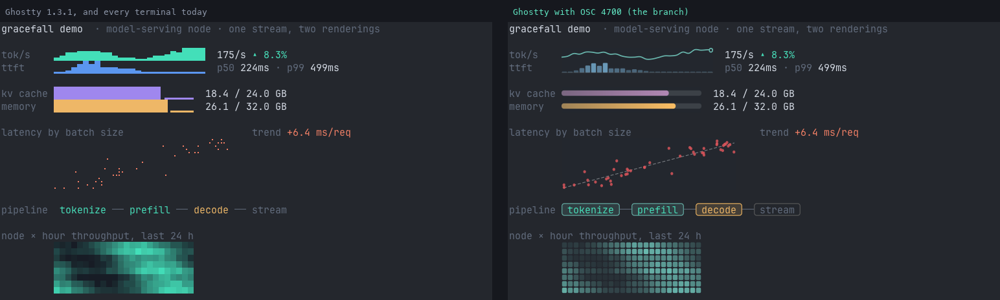
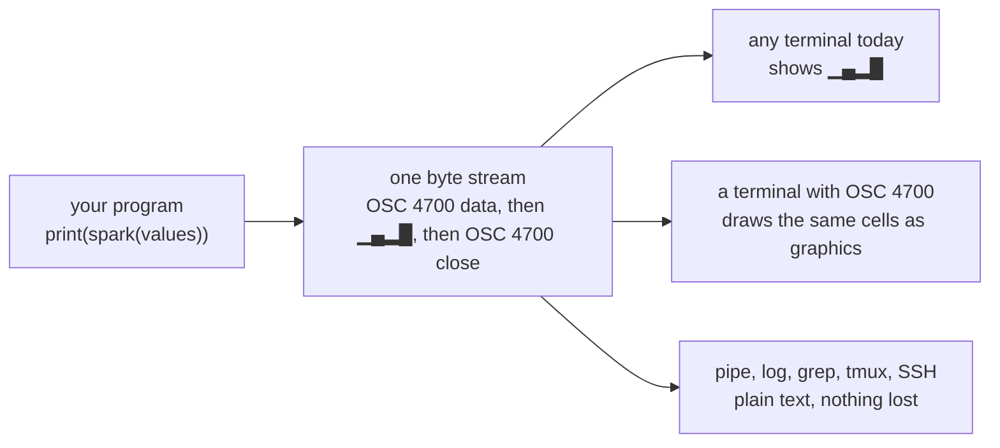
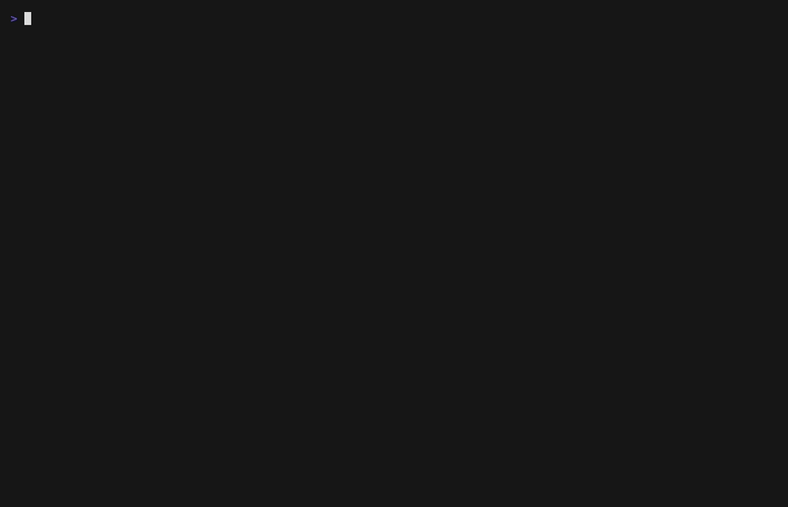
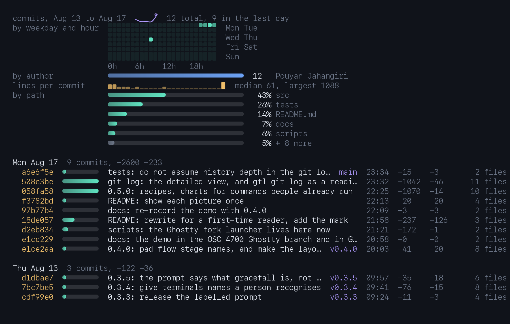

<div align="center">


# gracefall

**Charts for the terminal that never break. Text everywhere, vector graphics where the terminal can draw.**

A program prints a chart once. In every terminal that exists today it shows as
readable unicode blocks. In a terminal that implements OSC 4700 the same bytes
are drawn as smooth, theme-aware graphics. Nothing to detect, nothing to
negotiate, and the text stays selectable, greppable and readable by a screen
reader either way.

[](https://pypi.org/project/gracefall/)
[](pyproject.toml)
[](pyproject.toml)
[](https://github.com/PouyanJay/gracefall/actions/workflows/ci.yml)
[](SPEC.md)
[](LICENSE)

[Why it exists](#why-it-exists) ·
[How it works](#how-it-works) ·
[Quick start](#quick-start) ·
[The seven types](#the-seven-types) ·
[See it drawn](#see-it-drawn) ·
[Recipes](#recipes) ·
[Status](#status) ·
[Spec](SPEC.md)

</div>

---

## Why it exists

Putting a chart in a terminal today means choosing between two bad options.
Draw pixels (Sixel, kitty graphics, iTerm2 images) and a terminal that lacks
the protocol prints garbage or nothing, so you first have to ask what the
terminal is, and that question fails over SSH, inside tmux, in a pipe and in
a recording. Or print unicode blocks, which work everywhere and never get
better.

gracefall does both at once. Every chart is generated unicode text wrapped in
an envelope that carries the data behind it:

```
ESC ] 4700 ; t=spark ; d=1,4,2,8 ; c=blue ST   ▁▄▂█   ESC ] 4700 ; ST
```

A terminal that does not know OSC 4700 ignores the envelope and prints
`▁▄▂█`, which is already a chart. A terminal that does know it draws those
same cells as vector graphics in the theme's colours. Here is `gracefall
demo`, the same bytes, in two real Ghostty windows: the released 1.3.1 on
the left, and a build with OSC 4700 on the right.



Because the fallback is ordinary text in ordinary cells, everything a
terminal already does keeps working: selection, copy, grep, scrollback, tmux
replay, screen readers, `tee` to a log file. And because the envelope carries
data rather than pixels, the terminal owns the rendering and adapts it to
theme, font size and DPI.

## How it works



Four rules hold the whole thing together. They are the contract in
[SPEC.md](SPEC.md), and every part of this repository is checked against them.

| Rule | What it means in practice |
|---|---|
| **Live inside the byte stream** | No side channel, no new file format, no daemon. It is text with an envelope. |
| **Zero coordination** | No capability query, no round trip. Emitting is safe over SSH, into a pipe, into a recording. |
| **Degrade at the receiver** | The emitter never asks what the terminal is. The terminal decides what it can draw. |
| **Preserve text semantics** | The fallback is real cells, so selection, grep, scrollback and screen readers work by construction. |

Two consequences follow. The fallback is always generated from the same data
by the same function, so it cannot drift from the envelope. And payloads are
data, never pixels and never drawing commands, so a chart is small (an
envelope is capped at 2048 bytes) and a terminal can re-render it however it
likes.

## Quick start

```sh
uv tool install gracefall        # or: pipx install gracefall
```

Pure Python 3.9+, standard library only, no dependencies. `gfl` is installed
as a short alias.

```sh
seq 1 20 | gracefall spark
gracefall meter 0.62 -c amber
gracefall flow build:done test:done canary:active prod:pending
gracefall dist --bins 20 < latencies.txt
paste xs.txt ys.txt | gracefall scatter
gracefall demo
```


That recording is a plain `xterm-256color`, so every chart in it is the
fallback text. The last line makes one envelope visible: the data, the
blocks, the close.

Piping is safe by default. Envelopes are emitted only when stdout is a
terminal, so `gracefall spark ... | less` and shell captures get plain text.
`--force-osc` keeps them (to save a stream), `--no-osc` strips them always.

```sh
gracefall demo --force-osc > examples/inference.gfall
cat examples/inference.gfall                        # safe in any terminal
grep "kv cache" examples/inference.gfall            # it is text
gracefall render examples/inference.gfall -o out.svg
```

As a library:

```python
from gracefall import spark, meter, flow

print("p99  " + spark([92, 88, 84, 90, 97, 84], color="blue") + "  84ms")
print("disk " + meter(0.62, color="amber"))
print(flow(["build", "test", "deploy"], ["done", "active", "pending"]))
```

## The seven types

Every type is declarative data. The middle column is what a plain terminal
shows; the right column is what a drawing terminal makes of the same bytes.

| Type | Plain terminal | Drawn |
|---|---|---|
| `spark` | `▁▃▂▆▄█▇█` | smooth line with a marker on the last value |
| `meter` | `███████▍▁▁▁▁` | rounded gauge with a gradient fill |
| `dist` | `██▃▁▃▃▁▁▁▃` | histogram bars |
| `flow` | ` build ── test ── deploy ` | status capsules around each stage name |
| `scatter` | braille dots | points with a dashed trend line |
| `heat` | half-block cells | a grid of rounded, graded cells |
| `lanes` | `│╲ ●` box drawing | one row of a commit graph: lanes as smooth curves, commits as discs, merges hollow |

Colours are roles, not values: `fg dim teal blue amber coral violet`. The
terminal resolves them against its theme, which is what makes one stream
correct on both light and dark backgrounds.

### The creature: charts all the way down

The cat at the end of `gracefall demo` is made of those same seven types
and nothing else. It is a single `scatter`: a braille grid is two dots per
cell across and four down, so a creature thirteen cells wide by four rows
is a 26 x 16 canvas and one twenty six by eight is 52 x 32. Under it sits
a `meter` of the load, because the mascot reports as well as breathes.

```
⠀⠀⠀⠀⠀⢀⢆⠀⠀⠀⠀⠀⠀⡰⡀⠀⠀⠀⠀⠀
⠀⠀⠀⠀⠀⢞⡠⠷⠒⠒⠒⠒⠾⢄⡣⠀⠀⠀⠀⠀
⠀⠀⠀⢠⣤⡏⠰⠯⠇⠀⠀⠺⠽⠆⢹⣤⡄⠀⠀⠀
⠀⠀⠀⠐⠊⠣⣀⠀⠤⠬⠧⠄⠀⣀⠜⠑⠂⠀⠀⠀
⠀⠀⠀⠀⠀⠀⠀⠉⠉⠑⠊⠉⠉⠀⠀⠀⠀⠀⠀⠀
  ██████▋▁▁▁▁▁▁▁▁▁
```

At one and two rows there are not dots enough for a face, so there it is a
`lanes` figure instead, the primitive a commit graph row is made of: `l`
and `r` meeting as an ear, a commit disc as an eye, a rule as a mouth, and
a tail that wags.

```
╱╲ ● ── ● ╱╲│   idle          ╱╲ ● ╲╱ ● ╱╲│   happy
╱╲ ● ││ ● ╱╲│   working       ╱╲ ─ ── ─ ╱╲│   sleepy
```

So it degrades like every other chart: braille and box characters in a
plain terminal, drawn where OSC 4700 is, and the frames are pure functions
of a mood, a fractional tick and a dict of signals, so they can be
golden-tested like anything else. No type was added for it, and none was
needed: if a cat can be assembled out of seven declarative data types, an
application's real chart certainly can.
[docs/creature.md](docs/creature.md) is the anatomy.

#### `gfl bake` and `gfl play`

```sh
gfl bake -o cat.flip --frames 120 --cols 78 --rows 30
gfl play cat.flip                     # loops until you press a key
gfl play cat.flip --once --fps 12
head -c 200 cat.flip                  # it is a text file
```

A flipbook: every frame rendered once, ahead of time, and swapped at a
fixed rate. Nothing is computed at playback, so the player is a repaint
loop and a clock. The frames are drawn with tone rather than outline, one
`heat` span per row, ten levels of ink a cell:

```
           #                      %
          *%+                    +%*
         +#%*=                  =*%*=
        =*#%*+                  +#%#+=
        +*#%#*=                +*#%#*+
       ++*#%#*+= @@@@@%%%%%%% =+*#%#*+=
      =+*#%%@@@@@@@%%%%%%%%%######%%#*+=
     =++*@@@@@@@@@@@%%%%%%%%######**#*++=
       @@@@@@@..@@@@@%%%%%%###..*******
     @@@@@@...@...@@@%%%%%%....@...*++++#
    @@@@@@@..@@@@..@@%%%%%#..@@@@..++++++#
    @@@@@@@@......%%%%%%####......+++++++*
    %%%%%%%%%%%%%%%%%%####****++++++++++++
    %%%%%%%%%%########@****+++++++++++++++
    %############******++++++++++++++++++*
     #************++++++++++++++++++++++*
      ****+++++++++++++++++++++++++++++*
        *++++++++++++++++++++++++++++*
          *++++++++++++++++++++++++*
              *++++++++++++++++*
```

The technique is the one an ASCII render of a 3D model uses. What differs
is what a frame is made of: baked characters would be a picture of a
terminal, and these are spans, so the same flipbook is block art in a
plain terminal and vector graphics in one that implements OSC 4700, and
stays selectable, greppable text either way.

The file is deliberately dull, a header of `key=value` lines and frames
separated by a form feed, with rows written exactly as they will be
printed. You can read one with `less -r`, diff two, and cut one with
`head` without a parser.

#### `gfl pet`

```sh
gfl pet              # watch it until you press a key
gfl pet --graphics   # drawn, in Ghostty, kitty or WezTerm
gfl pet --once       # one frame, for a prompt or a recording
```

It repaints twenty times a second through the same loop the live recipes
use, and the machine drives it: the load average over the core count is
the belly and the swing of the arms, an uncommitted tree turns the crown
amber, and `GFL_CI=pass` or `GFL_CI=fail` in the environment is the mood.
The tree is asked at most every five seconds, the readings are taken
twice a second rather than once a frame, and nothing here touches the
network. `--mood` holds one mood, `--size` takes one, two or four lines,
`--every` sets the frame rate, and any key leaves with the last frame
still on screen.

The creature's speed and the frame rate are separate: it moves at two
beats a second whatever `--every` is, because its frames are pure
functions of a fractional tick taken from the clock. Drawing it more often
shows more of the same motion rather than faster motion.

`--graphics` draws the creature instead of quantizing it, through the same
kitty graphics shim as `gfl view`. It is worth having because the fallback
has a ceiling that no frame rate reaches: thirteen cells with eight
vertical steps each is all the resolution there is, so an arm moving a
hundredth of a cell renders as an arm not moving. The drawn creature reads
back the creature's own spans and composites them through `shapes.py`, so
it cannot disagree with the text one. A terminal without image support
gets the text creature and a line saying why.

#### `gfl replay`

```sh
gfl replay session.gfall              # the recording, through less
gfl replay session.gfall --pet        # with the creature reading it
gfl replay session.gfall --speed 0.5  # half pace
```

A `.gfall` file is a stream a terminal already knows what to do with, so
replaying one is `cat` with a clock on it: the bytes that go out are the
bytes in the file, and `gfl replay f | cat` is `cat f`. With `--pet` the
bottom line is reserved with a scroll region, the recording scrolls above
it, and the creature sits on it reading what goes past: a coral meter or
a word about failure makes it wince, a teal meter or `passed` cheers it,
a `lanes` graph makes it look up. What scrolls above is identical either
way, because the creature is painted between DECSC and DECRC on a row
outside the region, and the region is given back on every exit path.

There is no timing in the file, so the default writes it out as it is and
`--speed` paces it evenly instead, about two thousand cells a second at
`--speed 1`. Recording a session is the other half of this and is not
here yet.

## See it drawn

There are three ways to see the smooth rendering, in increasing order of
how native they are.

**`gfl view`** paints the drawing over the text using the kitty graphics
protocol, which Ghostty, kitty and WezTerm already speak. It is a stand-in
for a terminal that implements OSC 4700, and it works today:

```sh
uv tool install "gracefall[view]"     # adds Pillow, the only optional dependency
gracefall demo --force-osc | gfl view
gfl view --watch examples/sysmon.sh   # live, repainting in place
```

**`gfl shell`** runs your normal shell inside gracefall so anything any
program emits is drawn as it scrolls past, with nothing to pipe. In a
terminal that cannot draw, it offers to open one that can:

```sh
gfl shell
```

**A terminal that implements OSC 4700 natively** needs neither. A working
implementation exists as a
[Ghostty branch](https://github.com/ghostty-org/ghostty/compare/main...PouyanJay:ghostty:osc-4700-mvp):
about 3000 lines under `src/terminal/`, the six original types (`lanes` is next), drawn through
Ghostty's existing image storage so reflow and scrollback come for free.
It is proposed upstream in
[ghostty-org/ghostty#13884](https://github.com/ghostty-org/ghostty/discussions/13884).
The comparison at the top of this page is that branch next to Ghostty
1.3.1.

Notes on how `gfl view` finds each span's cells, and its limits under tmux
and scrollback, are in [docs/view-notes.md](docs/view-notes.md).

## Recipes

Charts for commands you already run. One line in your rc file:

```sh
eval "$(gfl init zsh)"      # or bash
```

and these commands start showing a chart, in any terminal:

| you type | you also get |
|---|---|
| `git log` | a spark of commits per day over the last eight weeks, under the log. `gfl fmt --full git log` (or `export GFL_FULL=1`) adds when in the week they land, who made them, how big they are and which paths they touch, and the log's own `--since`, `--author`, `-n` and range arguments narrow the chart |
| `df` | one meter per volume, most full first, with df's own percent. `gfl fmt --full df` is every volume df printed: space meter, percent, used / total, an inode meter and the device |
| `du -s *` | one meter per entry, largest first |
| `ping host` | a live latency spark that stays under the replies |
| `claude` | a greeting on the way in, and on the way out how long the session ran, how many commits it made and the diff it left behind |
| `pytest`, `npm test` | a meter of passed against failed, after the summary |
| `git shortlog -sn` | one meter per author, most commits first |
| `git diff`, `git diff --stat` | added against removed per file, two meters on one scale, and the total's added share |
| `git branch -v` | ahead and behind the upstream per branch, most recent first, the checked-out one bold |
| `git status`, `git status -sb` | the branch against its upstream, and staged / unstaged / untracked / conflicts as meters |
| `git blame file` | line ownership, one meter per author |
| `git log --stat` | the commits spark plus churn per commit in time order |
| `gh pr list` | a meter of each PR's checks (teal, amber while pending, coral on a failure), its age and review state, and a dist of how long PRs have been open |
| `gh pr checks` | the pipeline as a flow (only what needs attention past two dozen checks) and a meter of passed against all |
| `gh run list` | a success-rate meter per workflow and a spark of run durations |
| `du -h --max-depth=1` | one meter per entry at that depth, largest first; `--full` every entry and a dist of the sizes |
| `ls -l` | the largest files as meters and a dist of every size in the listing |
| `free`, `vm_stat` | memory used against total, the breakdown (used / cached / free, or app / wired / compressed / cached on macOS), and swap |
| `swapon`, `sysctl vm.swapusage` | swap in use, per device and in total |
| `iostat -w 1` | a live spark of disk throughput under the output, per-disk figures beside it (macOS and Linux shapes) |
| `smartctl -a /dev/…` | wear, temperature and spare as meters, hours and reallocated sectors, read from the output itself (NVMe and ATA) |

The command's own output is never touched. `git log` still pages and
colours; `pytest` still prints its dots and its tracebacks. A recipe either
prints its chart *after* the real command returns, from a query it makes
itself, or relays the command through a pty and adds the chart beside it.
Nothing runs unless stdout is a terminal, so pipes, scripts and CI see
exactly what they saw before. And when a parser does not recognise the
output, it draws nothing and says nothing.

`gfl fmt` lists the recipes. `gfl init zsh` prints the functions, so you
can read them before you eval them. `gfl fmt --watch df` (or `du`, or
`git log`, `--every 5` for the interval) redraws the chart in place until
Ctrl-C, which with `--full` makes a live disk panel out of `df`. More candidates, and the three tests a
command has to pass to earn one, are in
[docs/recipes.md](docs/recipes.md).

The three live recipes, `ping`, `pytest` (with `npm test`) and `iostat`,
keep a companion on that live line. The creature paces while a suite runs,
turns coral the moment a test fails and signs the final meter, bobs with
the round trip under `ping`, and swims at the throughput under `iostat`.
It is the same mascot the demo draws, so it is spans too, and the relay
animates it on its own clock rather than waiting for the command to say
something. `gfl fmt --no-pet`, or `GFL_PET=0` in the environment, turns it
off, and like every recipe it never appears when stdout is not a terminal.
### Wrapping a full-screen tool

`claude`, `vim`, `lazygit` and anything else that takes the whole screen
are the hard case, because there is nothing to add to: a full-screen tool
owns every cell, and a byte printed beside it lands somewhere it did not
plan for. So nothing is printed while it runs. The creature waves for a
second, the line it used is taken back before the tool's first paint, and
the pty is relayed byte for byte with the keyboard and every window size
change passed through. The tool's screen is the screen it would be
without gracefall.

```sh
gfl fmt --around vim src/gracefall/recipes.py     # or lazygit, nvim, anything
claude                                            # after eval "$(gfl init zsh)"
```

The payoff is on the way out:

```
  session  42 min  ·  3 commits  ·  tree changed

  src/gracefall/recipes.py  ███████████████ +181   ██▍▁▁▁▁▁▁▁▁▁▁▁▁ -19
  tests/test_recipes.py     █████▎▁▁▁▁▁▁▁▁▁ +71    ▏▁▁▁▁▁▁▁▁▁▁▁▁▁▁ -2
  total                     ████████████████████████████▏▁▁  2 files, +252 -21 (92% added)
```

The tree is recorded before the tool starts with `git stash create`, which
writes a commit for a dirty tree without touching the working tree, the
index or the stash ref, so the diff counts uncommitted work as well as
commits. Outside a repository the summary is the elapsed time alone, and a
session that changed nothing says so in one line rather than drawing an
empty chart.

### Reading history: `gfl git log`

The recipe leaves `git log` alone. When the question is "what happened
here" rather than "which commit", `gfl git log` is the other view: the
same summary on top, then the commits grouped under day headers, one line
each with a size meter, so the busy days and the big commits stand out
before you read a word.

```sh
gfl git log                  # last 8 weeks
gfl git log -50              # or any git log argument: --since, --author,
gfl git log v0.4.0..HEAD     # --grep, --no-merges, a range, a pathspec
```



That is the fallback, in a terminal with no graphics support at all. The
same bytes through the reference renderer's enhanced view, which is what
a terminal implementing OSC 4700 draws:



Tags and local branches sit at the end of the subject column; merges say
`merge` where the meter would be. It pages through `less -rFX` (or
`$GFL_PAGER`), so `/`, `n`, `g`, `G` and `q` are the navigation, as under
`git log`. `-r` rather than `-R` because `less -R` strips the OSC
envelopes and prints their attributes as text. `--no-summary` skips the
charts, `--no-pager` writes straight out, and piped it is plain text.
Patches are not this view's job; `git log -p` and `delta` own those.

`gfl git graph` (or `gfl git log --graph`) is the branch view: a compact
coloured graph of every branch, one commit per line with hash, refs,
subject, and the author and age dimmed at the right. git computes the
lanes, in the role palette; each row goes out as a `lanes` span, so a
plain terminal shows box characters, padded into one column with merges
as a hollow dot, and a terminal that draws OSC 4700 shows the lanes as
smooth curves and the commits as discs. Same arguments,
same pager; 300 most recent commits unless you say `-n`, `--since` or a
range.

```
  ○ │             159cf6d7e pkg/wuffs: use C-only mirror of wuffs (#13789)      Mitchell Hashi  13h
  │╲ ╲
  │ ● │           7c4c7adad pkg/wuffs: use C-only mirror of wuffs               Jeffrey C. Oll   4d
  ○ │ │           385a378fe termio: preserve UTF-8 in desktop notification tr…  Mitchell Hashi  13h
  │╲ ╲ ╲
  │ ● │ │         53c6fdbe7 apprt: own desktop notification truncation            dolzhenko.e4   2d
```

### By hand

Any pipeline that produces numbers is a recipe. Each of these is a live
reading of your machine, in any terminal:

```sh
# disk usage as a meter
df -H /System/Volumes/Data | awk 'NR==2{gsub(/%/,"",$5); print $5/100}' \
  | xargs -I{} gracefall meter {} -c amber -w 30

# cpu across the busiest processes
ps -A -o %cpu | tail -n +2 | sort -rn | head -30 | gracefall spark -c teal

# commits per day, last 30 days
git log --since=30.days --format=%ad --date=short | sort | uniq -c \
  | awk '{print $1}' | gracefall spark -c violet

# request latency from a log, as a histogram
awk '{print $NF}' access.log | gracefall dist --bins 30

# deploy status
gracefall flow build:done test:done canary:active prod:pending
```

[examples/sysmon.sh](examples/sysmon.sh) puts several of these together into
a dashboard. Run it once, or live:

```sh
examples/sysmon.sh
gfl view --watch examples/sysmon.sh
```

## Status

| Part | State |
|---|---|
| Emitter, CLI, library | Working. On PyPI as `gracefall`. |
| Reference renderer | Working. SVG and PNG out, and the thing CI checks the emitter against. |
| `gfl view` and `gfl shell` | Working, verified in Ghostty and kitty. |
| Recipes (`gfl fmt`, `gfl init`) | git log, shortlog, diff, branch, status, blame; gh pr list, pr checks, run list; df, du, ls -l, free / vm_stat, swapon / sysctl vm.swapusage, iostat, smartctl, ping, pytest and npm test. |
| `gfl git log` | History as a reading format: summary on top, commits under day headers with a size meter, through your pager. |
| `gfl git graph` | Every branch as a compact coloured graph, one commit per line, git's lanes in the role palette. |
| Native OSC 4700 in a terminal | One implementation, the Ghostty branch above. Proposed upstream, not merged. No released terminal ships it yet. |
| Specification | Draft 1, in [SPEC.md](SPEC.md), CC0. |

That last row is the honest state of a young protocol, and it is the row
that matters most. If you maintain a terminal, the whole thing is seven
declarative types and three drawing primitives; the geometry lives in one
module ([shapes.py](src/gracefall/shapes.py)) so it can be ported line by
line, and the Ghostty branch shows what a complete port looks like. Open an
issue and we will help.

## Development

```sh
make help          # everything below, and more
make test          # the suite; CI runs this exact target
make verify        # tests plus a pixel diff of the rendering against HEAD
make visual-diff REF=v0.3.5   # pixel diff against any git ref
make smoke         # build the wheel, install it clean, exercise the CLI
make compare       # docs/compare.png, both views through the reference renderer
make gitlog-demo   # docs/gitlog.gif via vhs, docs/gitlog.png through the renderer
make ghostty-run   # build, sign and launch the OSC 4700 Ghostty fork
```

The tests are invariants, not coverage: the fallback is clean text, the
renderer reads what the emitter writes, every span fits the size cap,
piped output is plain text. `make visual-diff` rasterizes the rendering
before and after a change and compares pixels, because a string diff of SVG
once hid a real regression in 79 pixels.

## Shell integration

`shell/gracefall.zsh` provides completions for every subcommand:

```sh
zinit light PouyanJay/gracefall
```

## Contributing

Read [SPEC.md](SPEC.md) first; it is short. Adding a type means touching the
emitter, the spec, the CLI, the geometry module, the completions and the
tests, and the [CHANGELOG](CHANGELOG.md) says what changed in each release.
Bug reports with a saved `.gfall` stream attached are the easiest to act on.

## License

Code is MIT. The specification text in [SPEC.md](SPEC.md) is CC0, so any
terminal can copy it without attribution. The logo is built from two
[Hugeicons](https://hugeicons.com) free icons (MIT).
