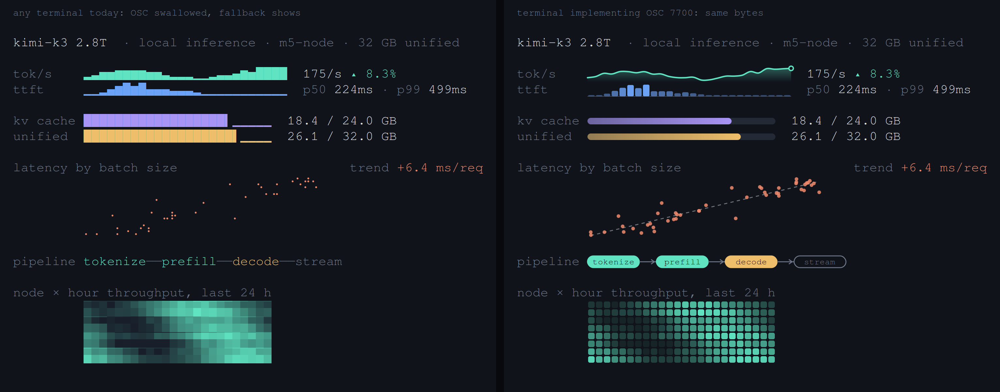

# gracefall

Fallback-first graphics for terminals. One byte stream, two renderings.

Every chart gracefall emits is wrapped in an OSC 4700 envelope carrying the
underlying data, with generated unicode fallback text as the envelope's
visible body. Terminals that don't know the protocol silently swallow the
envelope and show the fallback, which is already a real visualization.
A terminal that implements OSC 4700 re-renders the same cells as smooth,
theme-aware vector graphics.



The left panel is what `gracefall demo` shows in every terminal on earth
today, including macOS Terminal.app over SSH inside tmux. The right panel is
the same bytes in a terminal that implements the protocol. Nothing else in
the terminal ecosystem has this property: sixel prints garbage on a miss,
kitty graphics needs a query round trip, and both lose selection, grep,
scrollback, and screen readers. Here the fallback IS the text, so all of
that keeps working by construction.

## Install

```sh
uv tool install gracefall     # or: pipx install gracefall
```

Zero dependencies, pure stdlib Python 3.9+. `gfl` is installed as a short
alias for `gracefall`.

## Use

```sh
seq 1 20 | gracefall spark
gracefall meter 62% -c amber
gracefall flow build:done test:done canary:active prod:pending
gracefall dist --bins 20 < latencies.txt
paste xs.txt ys.txt | gracefall scatter
gracefall demo
```

Pipe-safety is automatic: envelopes are emitted only when stdout is a tty,
so `gracefall spark ... | less` and shell captures get pure fallback. Use
`--force-osc` to save a stream and `--no-osc` to strip unconditionally.

```sh
gracefall demo --force-osc > examples/inference.gfall
cat examples/inference.gfall        # safe in any terminal, try it
grep "kv cache" examples/inference.gfall
gracefall render examples/inference.gfall -o enhanced.svg
gracefall render examples/inference.gfall --plain -o plain.svg
```

`render` is the reference renderer: executable semantics for terminal
authors, and the thing CI uses to verify the emitter.

As a library:

```python
from gracefall import spark, meter, flow
print("p99  " + spark([92, 88, 84, 90, 97, 84], color="blue") + "  84ms")
```

## The protocol in 30 seconds

```
ESC ] 4700 ; t=spark ; d=1,4,2,8 ; c=blue ST  ▁▄▂█  ESC ] 4700 ; ST
```

Open envelope with data, visible fallback, empty envelope to close. The
span's cells are wherever the fallback lands, so there is no size
negotiation and no capability query. Payloads are data, never pixels and
never drawing commands, so the terminal owns rendering and can adapt it to
theme, font size, and DPI. Full details, including the four design laws and
the prior-art delta, are in [SPEC.md](SPEC.md).

## Status

- Emitter and CLI: working, v0.1
- Reference renderer: working (SVG out)
- Terminals implementing OSC 4700: none yet, and that is the honest state
  of a day-old protocol

If you maintain a terminal and want the first implementation, the renderer
module is ~300 lines of executable semantics and the type set is six
declarative primitives. Open an issue; the meter type alone is an afternoon.

## Shell integration

`shell/gracefall.zsh` provides completions. Any zsh plugin manager can load
it straight from this repo once published:

```sh
zinit light <user>/gracefall
```

## License

Code MIT. The specification text in SPEC.md is CC0 so implementations can
copy it freely.
