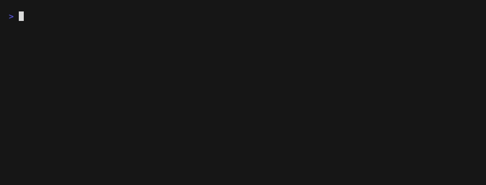

# gracefall

Fallback-first graphics for terminals. One byte stream, two renderings.

Every chart gracefall emits is wrapped in an OSC 4700 envelope carrying the
underlying data, with generated unicode fallback text as the envelope's
visible body. Terminals that don't know the protocol silently swallow the
envelope and show the fallback, which is already a real visualization.
A terminal that implements OSC 4700 re-renders the same cells as smooth,
theme-aware vector graphics.


The left panel is what `gracefall demo` shows in every terminal on earth
today, including macOS Terminal.app over SSH inside tmux. The right panel is
the same bytes in a terminal that implements the protocol. Nothing else in
the terminal ecosystem has this property: sixel prints garbage on a miss,
kitty graphics needs a query round trip, and both lose selection, grep,
scrollback, and screen readers. Here the fallback IS the text, so all of
that keeps working by construction.



That recording is a plain `xterm-256color`, so every chart in it is the
fallback text. The envelopes are being emitted the whole time and the
terminal is silently swallowing them, which is the entire design: emitting
is safe blind.

## Install

```sh
uv tool install gracefall     # or: pipx install gracefall
```

Zero dependencies, pure stdlib Python 3.9+. `gfl` is installed as a short
alias for `gracefall`.

## Use

```sh
seq 1 20 | gracefall spark
gracefall meter 62% -c amber
gracefall flow build:done test:done canary:active prod:pending
gracefall dist --bins 20 < latencies.txt
paste xs.txt ys.txt | gracefall scatter
gracefall demo
```

Pipe-safety is automatic: envelopes are emitted only when stdout is a tty,
so `gracefall spark ... | less` and shell captures get pure fallback. Use
`--force-osc` to save a stream and `--no-osc` to strip unconditionally.

```sh
gracefall demo --force-osc > examples/inference.gfall
cat examples/inference.gfall        # safe in any terminal, try it
grep "kv cache" examples/inference.gfall
gracefall render examples/inference.gfall -o enhanced.svg
gracefall render examples/inference.gfall --plain -o plain.svg
```

`render` is the reference renderer: executable semantics for terminal
authors, and the thing CI uses to verify the emitter.

## Seeing the smooth rendering today

No terminal implements OSC 4700 yet, so `gfl view` stands in for one. It
works out where each span's cells landed, rasterizes the span, and places
the image over exactly those cells using the kitty graphics protocol, which
Ghostty, kitty, and WezTerm already speak:

```sh
uv tool install "gracefall[view]"     # or: pipx install "gracefall[view]"
gracefall demo --force-osc | gfl view
```

`gfl view --watch 'some command'` re-runs the command on an interval and
repaints in place, and `gracefall render file.gfall --png` composes the same
picture to a PNG without needing a terminal at all, which is how the image
above is generated.

In a terminal without graphics support the same command prints the fallback
text unchanged and one line on stderr saying why. Inside tmux it does the
same, because tmux drops the graphics sequences unless you run
`tmux set -g allow-passthrough on`. The geometry comes from
the same module the SVG renderer uses, so the shim cannot drift from the
reference rendering. Notes on how it works, and its limits under tmux and
scrollback, are in [docs/view-notes.md](docs/view-notes.md).

## Recipes

Real commands, not the demo. Each one is a live reading of your machine.

```sh
# disk usage
df -H /System/Volumes/Data | awk 'NR==2{gsub(/%/,"",$5); print $5/100}' \
  | xargs -I{} gracefall meter {} -c amber -w 30

# memory used
vm_stat | awk '/Pages free/{f=$3} /Pages active/{a=$3} /Pages wired/{w=$4} \
  END{gsub(/\./,"",f); gsub(/\./,"",a); gsub(/\./,"",w); print (a+w)/(a+w+f)}' \
  | xargs -I{} gracefall meter {} -c violet

# cpu% across the busiest processes
ps -A -o %cpu | tail -n +2 | sort -rn | head -30 | gracefall spark -c teal

# commits per day, last 30 days
git log --since=30.days --format=%ad --date=short | sort | uniq -c \
  | awk '{print $1}' | gracefall spark -c violet

# request latency from a log, as a histogram
awk '{print $NF}' access.log | gracefall dist --bins 30

# deploy status
gracefall flow build:done test:done canary:active prod:pending
```

[examples/sysmon.sh](examples/sysmon.sh) puts several of these together into
a dashboard. It works in any terminal, and live in a graphics one:

```sh
examples/sysmon.sh                       # once
gfl view --watch examples/sysmon.sh      # live, repainting in place
```

`--watch` works in every terminal. Without graphics support it repaints the
fallback text, which is still a live dashboard.

A script used with `--watch` does not need `--force-osc`: the watch loop
sets `GRACEFALL_FORCE_OSC=1` for it, because the script's own stdout is a
pipe and the isatty rule would otherwise strip the envelopes it is being
asked to produce.

As a library:

```python
from gracefall import spark, meter, flow
print("p99  " + spark([92, 88, 84, 90, 97, 84], color="blue") + "  84ms")
```

## The protocol in 30 seconds

```
ESC ] 4700 ; t=spark ; d=1,4,2,8 ; c=blue ST  ▁▄▂█  ESC ] 4700 ; ST
```

Open envelope with data, visible fallback, empty envelope to close. The
span's cells are wherever the fallback lands, so there is no size
negotiation and no capability query. Payloads are data, never pixels and
never drawing commands, so the terminal owns rendering and can adapt it to
theme, font size, and DPI. Full details, including the four design laws and
the prior-art delta, are in [SPEC.md](SPEC.md).

## Status

- Emitter and CLI: working, v0.1
- Reference renderer: working (SVG and PNG out)
- `gfl view`, the kitty-graphics shim: working, verified in Ghostty and
  kitty
- Terminals implementing OSC 4700 natively: none yet, and that is the
  honest state of a young protocol

If you maintain a terminal and want the first implementation, the renderer
module is ~300 lines of executable semantics and the type set is six
declarative primitives. Open an issue; the meter type alone is an afternoon.

## Shell integration

`shell/gracefall.zsh` provides completions. Any zsh plugin manager can load
it straight from this repo once published:

```sh
zinit light PouyanJay/gracefall
```

## Changelog

[CHANGELOG.md](CHANGELOG.md).

## License

Code MIT. The specification text in SPEC.md is CC0 so implementations can
copy it freely.
